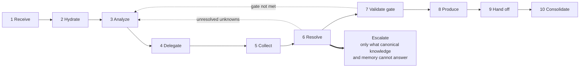
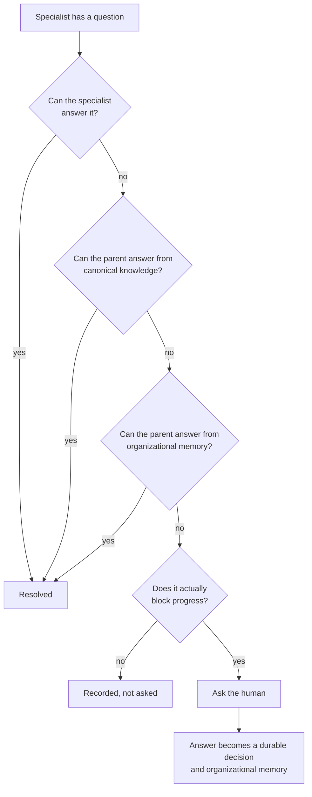
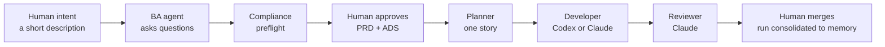

# Product Vision

> **You provide intent and judgment. AEP runs the engineering organization.**

## What AEP is

The Agentic Engineering Platform models a software engineering organization.

A human sits at the top as CTO and Product Owner. Below them, persistent specialized agent roles
do the work a real engineering organization does: business analysis, grooming, architecture,
planning, engineering, quality, review, integration, release. Each role is a durable identity with
its own memory, permissions, specialists and history. Each runs the same recursive loop. Questions
travel upward and reach the human only when nothing below can answer them.

## What AEP is not

Being precise here matters more than the positive statement, because every one of these is a
plausible misreading of the same description.

- **Not a coding-agent wrapper.** The unit is a role with continuity, not a session with a prompt.
- **Not a prompt framework.** Behavior that must always happen belongs in deterministic
  enforcement, not in prose asking a model to remember.
- **Not a GitHub automation framework.** GitHub is the control plane and owns execution state. It
  is not the product.
- **Not a multi-agent chat system.** Agents do not converse freely. Communication is structured,
  durable, and mediated by accountable parents.
- **Not an AI project manager.** It does not track your work. It does the work, under your
  judgment.

## Who it is for

**An experienced engineer working solo or leading a small team.** Someone who can already read an
architecture proposal, judge a specification, and tell a sufficient evidence package from a thin
one. Architect, technical lead, staff engineer, technical founder.

This is a deliberate narrowing. An earlier version of this document said "technically
sophisticated solo founders and 2–10 person engineering teams", which invited a reader who cannot
exercise the judgment every gate in this system asks for. **A gate is only real if the person
closing it knows enough to refuse.** The ceremony pays for itself when there is judgment to apply,
a compliance obligation to satisfy, or a project large enough to lose track of why a decision was
made. For someone learning the domain as they build, it is overhead attached to approvals they
cannot yet give.

**Explicit non-user: the non-technical founder.** AEP does not substitute for technical judgment.
It multiplies it.

## Where AEP begins and ends

AEP begins when you have intent you can articulate. It does not do the work before that, and
saying so plainly is more useful than implying coverage.

| Not AEP | AEP | Not AEP |
| --- | --- | --- |
| Market validation, user research, deciding what to build | Intent through delivery: analysis, architecture, planning, implementation, quality, release | Running the product in production |
| Visual and interaction design, brand, mockups | | Customer support, growth, operations |

Bring the research and the design. Hand AEP the result. Its UX roles are requirements analysts,
not designers.

## The organization

```mermaid
flowchart TB
    H["Human · CTO / Product Owner<br/>intent · judgment · approvals"]
    BA["Business Analysis"]
    GR["Grooming & Refinement"]
    AR["Architecture"]
    PL["Planning & Orchestration"]
    EN["Engineering"]
    QA["Quality & Security"]
    RV["Review & Integration"]
    RL["Release & Operate"]
    G["Human Gate<br/>approve · redirect · stop"]

    H --> BA --> GR --> AR --> PL --> EN --> QA --> RV --> RL --> G
    G -. "change requests originate at any stage" .-> BA
    G -. .-> AR
    G -. .-> EN

    BA -.- BAS["Compliance · Legal<br/>Privacy · Domain"]
    AR -.- ARS["Security · Data<br/>Integration · Platform"]
    QA -.- QAS["Functional · Integration<br/>Security · Performance<br/>Accessibility · Regression"]
```

The dotted return paths are not decoration. Change requests originate at any stage and travel
back. A version of this diagram without them describes a pipeline, which is what AEP is not.

Every tier has specialists. Three are shown; all of them do.

## The loop every tier runs

Only the role configuration changes between tiers: which specialists exist at step 4, what the
completion gate checks at step 7, what artifacts step 8 produces. The sequence does not change.



The dotted edges back to step 3 are the recursion. Escalation is a branch, not a step: numbering
it would imply every pass escalates, and the human is the most expensive reasoning resource in the
organization. See ADR-023.

## How a question reaches you



You should receive meaningful ambiguity, missing authority, conflicting product direction,
consequential architecture decisions, compliance sign-off, security exceptions, and release gates.
You should not receive anything already answered by an approved artifact.

## The first mile

The smallest thing that proves the whole model. Not a phase, not a milestone: the minimum
executable proof that the organization exists at all.



**Prove the loop, then expand.** Everything in the roadmap beyond this is scaffolding around a
loop that has to work first. Until this runs end to end against this repository, every other claim
in this document is design rather than evidence.

## Product promise

> Your engineering process belongs to you. Models are replaceable workers.

A role is a durable organizational identity. A model is temporary compute. A session is ephemeral.
`compliance.primary` is the same colleague whether it runs on Claude today or Codex tomorrow, and
it keeps its memory, its specialists and its history across the change.

## Outcomes

A user should be able to:

- describe a product idea conversationally, without arriving with a polished specification;
- interact with a BA agent that asks the questions a strong human analyst would ask;
- receive compliance, legal, privacy, security and domain preflight without requesting it;
- approve a stable product specification, and have that approval recorded rather than assumed;
- have agents groom, architect, decompose and plan work into a dependency graph;
- dispatch implementation to the best available role and runtime;
- watch every active agent and intervene directly, never seeing only "agent running";
- hand a stuck role to a different provider mid-work without losing its context;
- keep per-role memory across ephemeral sessions;
- learn from failures, reviews, human corrections and successful patterns;
- regression-test models, prompts, skills, retrieval and orchestration changes;
- adopt an existing repository incrementally, without restructuring it first.

## Non-goals

- Replace Git as source control.
- Build another IDE.
- Provide autonomous legal advice or legal approval.
- Remove human responsibility for consequential decisions.
- Force all projects into a single document format.
- Require proprietary models or metered APIs.
- Serve users who cannot evaluate the decisions the gates ask them to approve.
- Do market validation, user research, or visual design.

## Honest status

This document describes the intended system. Most of it is **designed**, a little is
**implemented**, and only what CI runs is **proven**.

Implemented today: a documentation validator, a human-gate check, an index generator, and
`devctl` with four commands. Not implemented: any runtime or service, the hook engine, the
database, the event store, retrieval, agent execution, and the workspace UI. Every binding in
`.agentic/hooks/hooks.yaml` is declarative; nothing executes them.

One limitation deserves naming rather than discovering. AEP is subscription-first because a team
already paying for Claude and Codex should get agentic development without moving to unpredictable
usage-based billing. **What a consumer subscription permits under automation is set by each
vendor's terms, not by this platform**, and unattended operation may fall outside them. Where it
does, the API adapter is the supported path. AEP will not pretend a subscription covers a use its
vendor does not allow.
