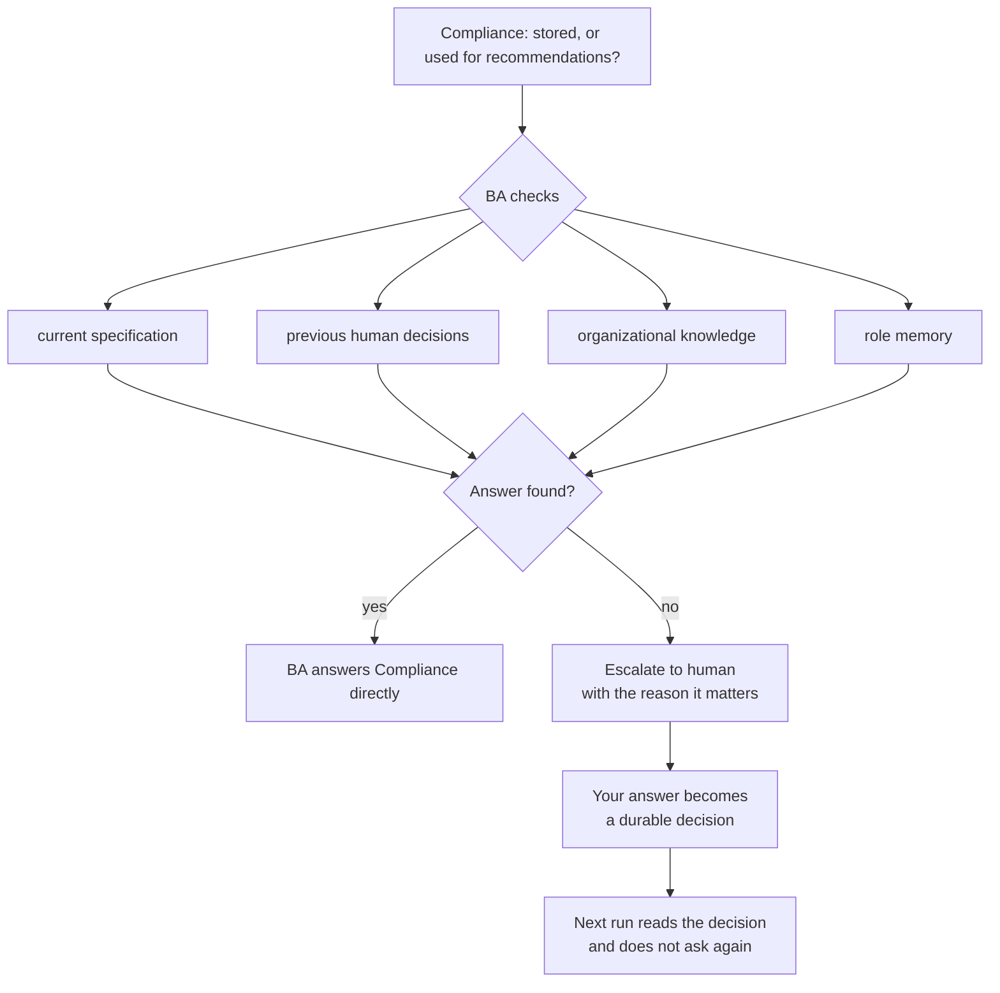
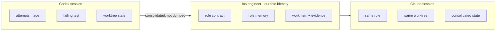
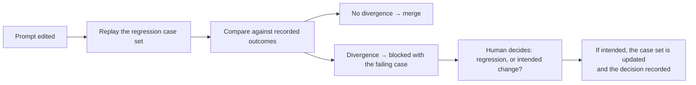
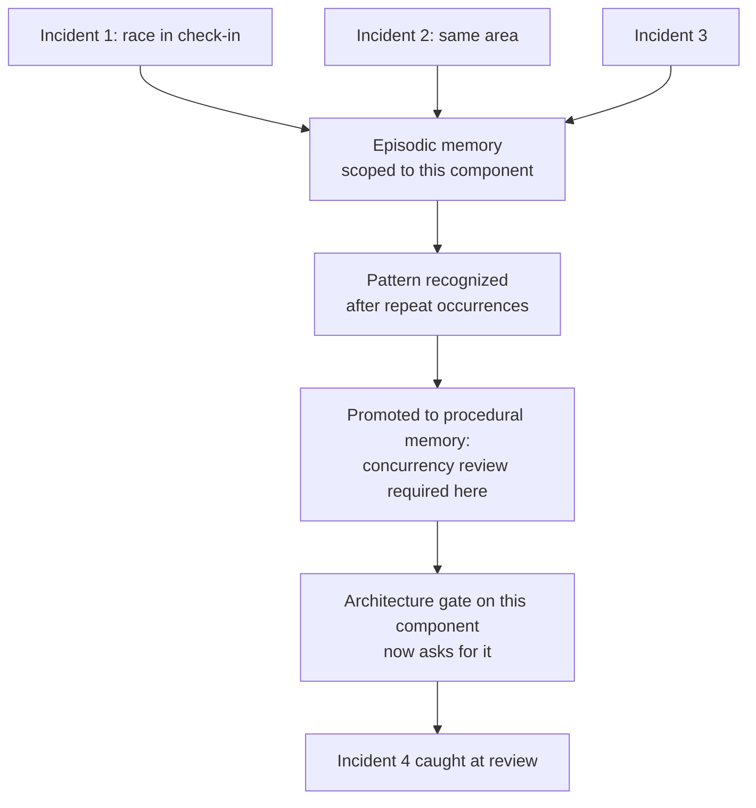

# Scenarios

Worked scenarios showing what AEP does that a coding agent does not. Each one is chosen because a
session-shaped tool fails it structurally, not because it does it badly.

**None of this runs today.** There is no runtime. These describe the designed behavior, and they
exist so the design can be argued with before it is built.

---

## 1 · The question that never reaches you

**Why this scenario:** it is the difference between an organization and a chat thread.

You say: *"I want parents to assign recurring chores to their kids and optionally tie rewards to
completion."*

The BA agent does not produce a specification. It asks. Are rewards monetary? Who confirms a chore
is done, the child or the parent? Can a chore be assigned to more than one child? What happens to
an unclaimed reward? While you answer, it delegates.

```mermaid
sequenceDiagram
    participant You
    participant BA as BA agent
    participant Priv as Privacy specialist
    participant Comp as Compliance specialist
    participant Mem as Organizational memory

    You->>BA: chores, kids, optional rewards
    BA->>Priv: children's data in scope?
    BA->>Comp: monetary rewards to minors?
    Priv-->>BA: COPPA applies; needs verifiable parental consent
    Comp-->>BA: is the reward real money or points?
    BA->>Mem: has this been decided?
    Mem-->>BA: no prior decision
    BA->>You: points or real money? it changes the compliance surface
    You-->>BA: points only, v1
    BA->>Comp: points only
    Comp-->>BA: no money-transmission surface; cleared
    BA->>You: PRD + ADS for approval
```

Two specialist questions were raised. One was answered by the BA without involving you, because
the answer was already in the specification. One reached you, because it was a product decision
only you could make, and your answer became a durable decision that the next run reads instead of
asking again.

**A coding agent would have picked one interpretation silently.**

---

## 2 · The compliance question that is really a product question

**Why this scenario:** it shows escalation refusing to shortcut.

Later, the same product adds document upload. The Compliance specialist finds something real:

> Are uploaded medical records merely stored and summarized, or used to generate personalized
> medical recommendations?

The distinction is enormous. One is storage. The other may be a regulated medical device.

Compliance does **not** interrupt you. It asks its parent.



The BA finds nothing authoritative, so it escalates, and it escalates *with the consequence
attached* rather than forwarding a raw question. You answer once. The answer is recorded as a
decision, not remembered as conversation.

**In a session-based tool this question is asked again in the next session, or worse, guessed.**

---

## 3 · The stuck role handed to a different provider

**Why this scenario:** it is the test of "role is not model", the claim the whole product rests on.

`ios.engineer` is implementing offline sync. Codex has been circling the same failing test for
forty minutes.

You hand the role to Claude. Not the conversation. The role.



Claude receives the role identity, the work item, the worktree, the consolidated session state,
the failures, and what was already tried. It does **not** receive the transcript. The point of
consolidation is that the next session inherits what was learned, not what was said.

**If this does not work, "role is not model" is a slogan.** It is untested today, and testing it
costs an afternoon: run one real issue through both providers by hand and diff everything but the
code.

---

## 4 · The regression a test suite cannot see

**Why this scenario:** it is the case where evidence beats intuition, and where CI is blind.

A conversational feature is driven by a long system prompt full of specific behavioral rules. One
edit to that prompt silently breaks a two-question flow. Every test still passes, because no test
asserts on prompt behavior.

The evaluation plane treats the prompt as a versioned artifact with a case set:



The immutable run history is what makes this possible. Cases are not written by hand; they are
promoted from runs that already happened, including the corrections you made.

**This is the piece a general coding agent structurally cannot offer, because it keeps no history
across sessions.**

---

## 5 · The mistake made four times

**Why this scenario:** it shows memory as prevention rather than recall.

A race condition appears in check-in and upload-queue logic. It is fixed. Two months later a
similar race appears in the same area. Then again. Then again. Each fix was correct. Nothing
carried forward.



Episodic memory records what happened. Procedural memory records what the organization learned to
do about it. Promotion between them is what turns four incidents into one rule, and the rule
attaches to the gate rather than to somebody's recollection.

**A human eventually notices this pattern. AEP's claim is that it should not depend on whether
they do.**

---

## What these scenarios have in common

Every one of them fails for a reason a better model does not fix:

| Scenario | What breaks without AEP |
| --- | --- |
| 1 | Ambiguity resolved silently instead of asked |
| 2 | The same question asked again next session |
| 3 | Being stuck means starting over |
| 4 | A regression no test can see |
| 5 | A lesson that lives in one person's head |

None of these is a capability problem. They are all continuity, structure and evidence problems.
That is the bet AEP makes: **the missing thing is not a smarter agent, it is an organization
around it.**
